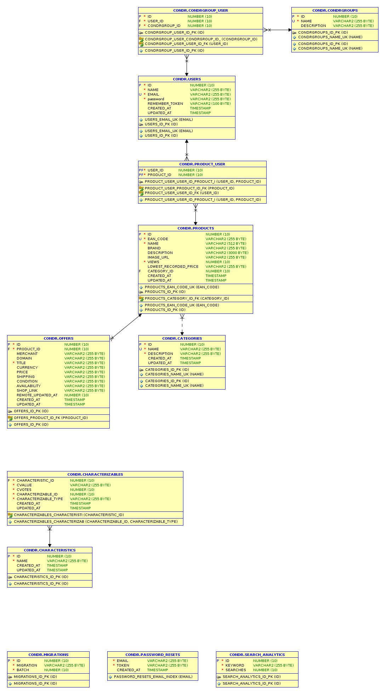

## Database schema



### Initialization scripts

These are run automatically on database initialization.

[Dockerfiles/oracledb/sqlscripts/00-init.sql](https://github.com/adrianharabula/condr/blob/master/Dockerfiles/oracledb/sqlscripts/00-init.sql)
```sql
-- =============================================
-- Authors: Adrian Harabula
-- Create date: Week 10-16 April 2017
-- Context: Preparing database before creating tables
-- =============================================

DROP TABLESPACE aplicatie_condr INCLUDING CONTENTS CASCADE CONSTRAINTS;

CREATE TABLESPACE aplicatie_condr
  DATAFILE 'tbs_permcondr_0001.dat'
    SIZE 500M
    REUSE
    AUTOEXTEND ON NEXT 50M MAXSIZE 2000M
/

CREATE TEMPORARY TABLESPACE aplicatie_condr
  TEMPFILE 'tbs_tempcondr_0001.dbf'
    SIZE 5M
    AUTOEXTEND ON
/

CREATE UNDO TABLESPACE aplicatie_condr
  DATAFILE 'tbs_undocondr_0001.dbf'
    SIZE 5M
    AUTOEXTEND ON
  RETENTION GUARANTEE
/


drop user condr cascade;
create user condr identified by condr;
-- alter user condr identified by new_password; # change user password
alter user condr default tablespace aplicatie_condr quota 1990M on aplicatie_condr;

grant connect to condr;
grant all privileges to condr;
/
```

[Dockerfiles/oracledb/sqlscripts/01-purgeProcedure.sql](https://github.com/adrianharabula/condr/blob/master/Dockerfiles/oracledb/sqlscripts/01-purgeProcedure.sql)
```sql
conn condr/condr;
create or replace PROCEDURE purgedatabase AS
begin

  --Bye Sequences!
  FOR i IN (SELECT us.sequence_name
              FROM USER_SEQUENCES us) LOOP
    EXECUTE IMMEDIATE 'drop sequence '|| i.sequence_name ||'';
  END LOOP;

  --Bye Tables!
  FOR i IN (SELECT ut.table_name
              FROM USER_TABLES ut) LOOP
    EXECUTE IMMEDIATE 'drop table '|| i.table_name ||' CASCADE CONSTRAINTS ';
  END LOOP;

END;
/
```

To purge database, call the function

```bash
sqlplus condr/condr@oracledb
> call purgedatabase();
```
