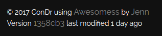

## Version naming



Additionally, the [webhook](pages/continous.md) script executes the `version-update` script on the server:

```bash
#!/bin/bash

VERSION=`git log --pretty="%h" -1`
LASTEDIT=`git log --pretty="%ce - %s" -1`
LASTEDITTIME=`git log --pretty="%ct" -1`
echo "$VERSION" > app/storage/app/version
echo "$LASTEDIT" > app/storage/app/version.lastedit
echo "$LASTEDITTIME" > app/storage/app/version.lastedit.time
```

Lastly these details we write them on the footer:

```blade
            <p>&copy; {{ date('Y') }} ConDr using <a href="http://themeforces.com/preview/?theme=free-awesomess-portfolio">Awesomess</a> by <a href="https://dribbble.com/jennpereira">Jenn</a> </p>
            @if (Storage::exists('version'))
            <p>Version <a href="https://github.com/adrianharabula/condr/commit/{{ Storage::get('version') }}">{{ Storage::get('version') }}</a> last modified {{ \Carbon\Carbon::createFromTimestamp((int)trim(Storage::get('version.lastedit.time')))->diffForHumans() }}</p>
            @endif
```
